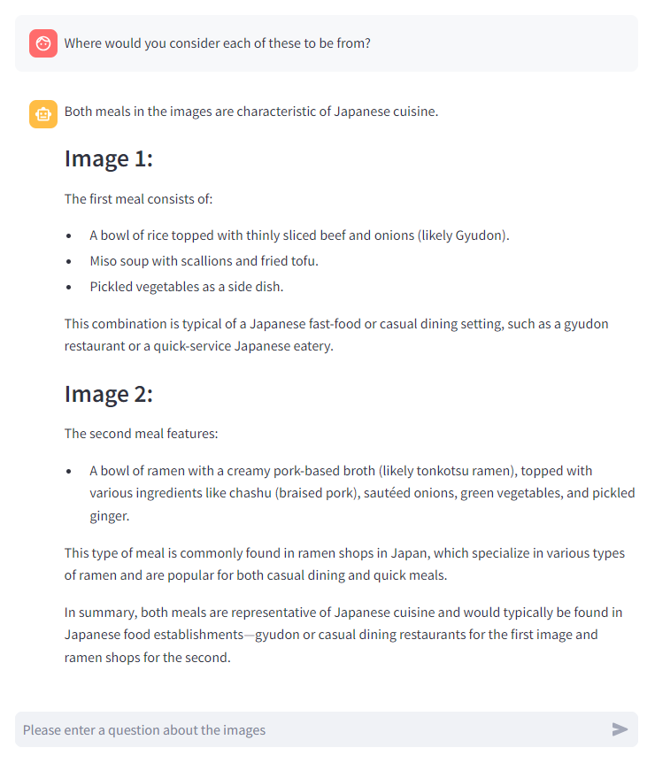

# azure-openai-vision-ui

Simple Web UI to try out vision capabilities on GPT-4o / GPT-4 Turbo.

# Setup

An example of the setup procedure is shown below.

```
$ git clone https://github.com/sh2/azure-openai-vision-ui.git
$ cd azure-openai-vision-ui/src
$ python3 -m venv .venv
$ source .venv/bin/activate
$ pip install -r requirements.txt
$ cd ..
$ cp template_script.sh script.sh
$ vim script.sh
$ ./script.sh
```

# Usage

First, upload your image files.
The format is JPEG or PNG, and each file can be up to 20 MB.
You may upload multiple files.


Next, ask a question about the image,
GPT-4o / GPT-4 Turbo will then return a message.


You can also ask additional questions.


